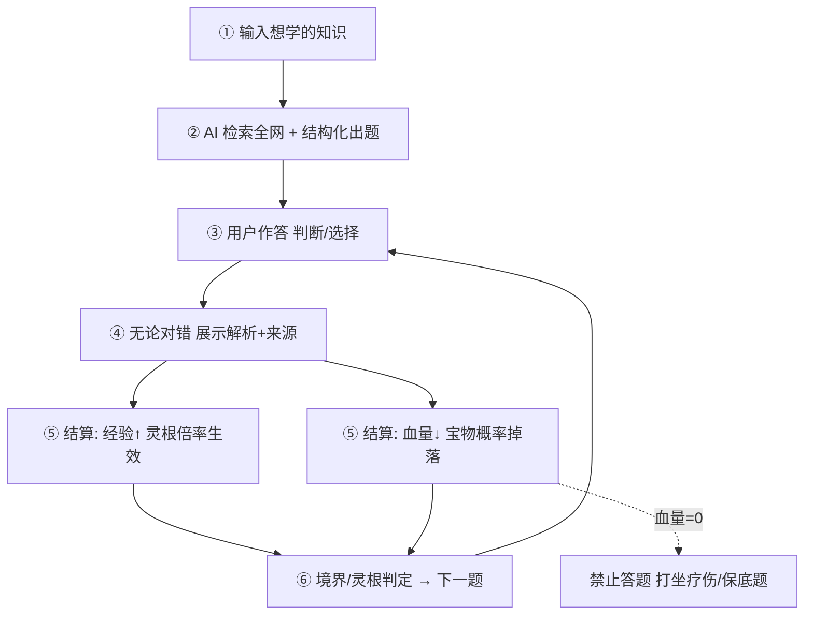

# 仙途 · AI 修仙主题自适应学习应用 — 项目计划书

> 项目代号：仙途（xiuxian） · 内部计划书 v0.1（草案）

**标签：** `AI 出题` `全网知识检索` `游戏化成长` `修仙世界观`

**一句话定位：** 用户自由输入想学的知识，AI 自动检索全网信息并生成题目（判断 / 选择 + 答案 + 解析），用户在"答题修仙"的闭环中积累经验、觉醒灵根、进阶境界、收集宝物。

---

## 一、项目概述与目标

> **要解决的核心问题：** 传统学习枯燥、缺乏即时反馈与正反馈激励；用户"想学某块知识"时往往不知从何入手、也缺少检验理解的手段。本项目用 **AI 出题 + 游戏化** 把"输入兴趣 → 获取知识 → 即时测验 → 反馈强化"压缩成 3 分钟一局的轻量化体验。

- **目标用户：** ①备考 / 自我提升的泛知识学习者；②喜欢修仙 / 国风叙事的年轻群体；③需要轻量复习手段的学生与职场人。
- **核心价值：** 把任意主题变成"可玩、可测、可成长"的修仙闯关，用正反馈（经验、宝物、境界）替代意志力。
- **差异化：** 输入即生成、解析即教学、成长即叙事——知识获取与 RPG 进度深度绑定。

---

## 二、核心功能模块

### 2.1 知识输入与目标设定
- 自由文本输入（如"量子力学基础""唐朝历史""Python 装饰器"），支持一句话或一段描述。
- 可选"深度 / 难度"：入门、进阶、精通；可选题目数量（默认 5–10 道）。
- 可选信息源偏好：全网检索（默认）或指定领域（百科 / 教材 / 论文 / 新闻）。

### 2.2 AI 知识获取与整合
- 调用联网检索（Search API / RAG）获取权威、多元资料。
- LLM 对资料做去噪、结构化摘要，形成"知识点图谱"再据此出题，降低幻觉。
- 每道题标注**知识来源链接**，解析中可一键溯源，保证可核查。

### 2.3 智能出题引擎
- 题型：判断题、单选题（可扩展多选 / 填空 / 简答）。
- 输出结构化 JSON：题干、选项、正确答案、难度、知识点、解析、来源。
- 围绕同一知识点出"判断 + 选择"组合，强化记忆。

### 2.4 答题与解析
- 逐题作答；**无论对错，答完立即展示解析**（用户原始设定）。
- 解析采用"为什么对 / 为什么错 + 关键概念 + 延伸"三段式。
- 支持"标记存疑 / 加入复习本"，为后续间隔重复打底。

### 2.5 修仙成长系统（产品灵魂）
由 **灵根 → 经验 → 境界 → 称号 → 血量 → 宝物** 六要素构成闭环激励，详见第三、四章。

---

## 三、修仙成长体系设计

### 3.1 境界（等级）体系
用户从"凡人"起步，经验累积触发突破。每个大境界下设 1–9 层（或 初期/中期/后期/大圆满），便于做细腻的正反馈。

**境界进阶：** 凡人 → 练气 → 筑基 → 金丹 → 元婴 → 化神 → 炼虚 → 合体 → 大乘 → 渡劫 → 仙人。

每突破一个大境界触发"天劫"动画与属性跃迁；用户可在每个大境界内看到 1–9 层的小进度条。

| 境界 | 累计所需经验（示例） |
|------|------|
| 凡人 | 0 |
| 练气 | 100 |
| 筑基 | 500 |
| 金丹 | 1500 |
| 元婴 | 4000 |
| 化神 | 9000 |
| 炼虚 | 20000 |
| 合体 | 45000 |
| 大乘 | 100000 |

> 数值为示例，平衡期可通过埋点 A/B 测试迭代调整。

### 3.2 灵根系统（经验倍率的核心）
用户初始为**凡人**，完成若干引导题（如 3–5 道）后触发"测灵根"仪式，随机/加权分配灵根，决定每题经验获取倍率。

| 灵根 | 经验倍率 | 稀有度 |
|------|------|------|
| 五灵根 | ×0.8 | 常见 |
| 双灵根 | ×1.0 | 常见 |
| 单灵根 | ×1.15 | 较稀有 |
| 变异灵根 | ×1.3 | 稀有（可附带被动，如答错仅扣半血） |
| 天灵根 | ×1.5 | 稀有 |
| 混沌灵根 | ×2.0 | 极稀有（可附带被动，如宝物掉率 +20%） |

> **设计要点：** 灵根只影响**经验获取速度**，不影响题目难度与解析质量，保证"非酋也能修炼，欧皇更快变强"的公平感。变异 / 混沌灵根可附带额外被动。

### 3.3 经验、血量与宝物（激励三角）

| 要素 | 规则 | 说明 |
|------|------|------|
| 经验 EXP | 每题 = 基础分 × 难度系数 × 灵根倍率 × (答对 1.0 / 答错 0.3) | 答对给满额，答错给少量"悟道"经验，鼓励坚持 |
| 血量 HP | 初始 100；答错扣血（难度相关，如 −8~−15） | **HP=0 时禁止答题**，需疗伤恢复（时间恢复 / 丹药） |
| 宝物 | 每题结算后有概率掉落（常见 5%~15%） | 丹药（回血/经验加成）、法宝（外观/被动）、功法（成长 buff） |
| 称号 | 由累计经验 + 正确率共同决定 | 如"炼气弟子""金丹真传""百答不怠""勘破虚妄" |

> **防卡死机制：** 血量耗尽后，提供"打坐疗伤"——离线随时间缓慢回血（如每 10 分钟 +5），或消耗"疗伤丹"立即恢复；同时赠送一道**低难度保底题**（答对必回血），避免用户彻底流失。

---

## 四、用户答题闭环流程

---

## 五、技术架构

| 层 | 选型建议 | 职责 |
|----|---------|------|
| 前端 / 客户端 | Web（React/Vue）优先，后续微信小程序 / Flutter 移动端 | 国风 UI：境界条、灵根图鉴、宝物背包 |
| 后端 | **Java Spring Boot 体系**（Spring MVC + Spring Security + **MyBatis-Plus** 持久层） | 出题编排、游戏化结算、用户态；Redis 缓存题目与限流 |
| AI 层 | 大模型 DeepSeek / 文心 / 通义 / GPT（可插拔） | 联网检索（Tavily / SerpAPI / Bing / 自建爬虫）+ 结构化输出校验（JSON Schema） |
| 数据与存储 | **MySQL**（主库，InnoDB）+ Redis（缓存）+ 对象存储 | 用户 / 题目 / 进度 / 宝物；头像与立绘资源；答题埋点 |

### 5.1 核心数据模型（概要）

| 表 | 关键字段 | 用途 |
|----|---------|------|
| users | id, nickname, realm(境界), layer, exp, hp, spirit_root, title | 用户成长主表 |
| spirit_roots | type, exp_multiplier, passive_skill | 灵根定义与倍率 |
| topics | user_id, keyword, difficulty, source_pref, created_at | 学习主题记录 |
| questions | topic_id, type, stem, options, answer, explanation, source_url, difficulty | 题目与解析 |
| user_answers | user_id, question_id, is_correct, gained_exp, hp_delta, treasure_id | 答题结算流水 |
| treasures | type, rarity, effect(回血/经验/被动), drop_rate | 宝物图鉴 |
| user_treasures | user_id, treasure_id, count, equipped | 背包 |

---

## 六、MVP 与迭代路线

| 版本 | 目标 | 范围 |
|------|------|------|
| **v0.1 · 验证** | 文字版 Demo | 输入主题 → AI 生成 5 题 → 作答 + 解析；基础经验/血量/境界，无灵根与宝物 |
| **v1.0 · 上线** | 修仙闭环 | 灵根觉醒、宝物掉落、称号、境界进阶动画、帐号与进度持久化 |
| **v2.0 · 留存** | 深度与社交 | 间隔重复复习、排行榜/宗门、更多题型、UGC 题库、付费灵根/外观 |

---

## 七、关键风险与对策

| 风险 | 对策 |
|------|------|
| AI 出题幻觉 / 错误答案 | 检索增强(RAG)+ 来源标注；解析可溯源；用户纠错反馈闭环；高风险题人工抽检 |
| 联网检索成本与延迟 | 题目缓存复用；热门主题预生成；异步生成 + 加载动画 |
| 游戏化削弱学习有效性 | 经验与"是否真正理解"弱绑定；解析强制阅读；加入复习本与正确率统计 |
| 数值平衡难（肝度/氪度） | 埋点驱动调参；A/B 测试掉率与扣血；保底机制防流失 |
| 冷启动内容空缺 | 种子题库 + 通用知识域预生成；鼓励 UGC 共享 |

---

## 八、下一步建议

- **本周：** 确定技术栈与大模型/检索供应商，搭建出题 API 最小可用链路（输入 → 结构化题目 JSON）。
- **两周内：** 完成 v0.1 文字 Demo，跑通"答题—经验—境界"主循环，邀请 5–10 名内测用户体验。
- **待确认：** 目标平台（Web / 小程序）、是否需帐号体系、美术风格（像素国风 / 水墨 / 二次元），再据此细化原型与排期。

---

*仙途 · AI 修仙主题自适应学习应用 — 项目计划书 v0.1（草案）。本文件为内部规划用途，数值与范围为示例，平衡期可迭代调整。*
